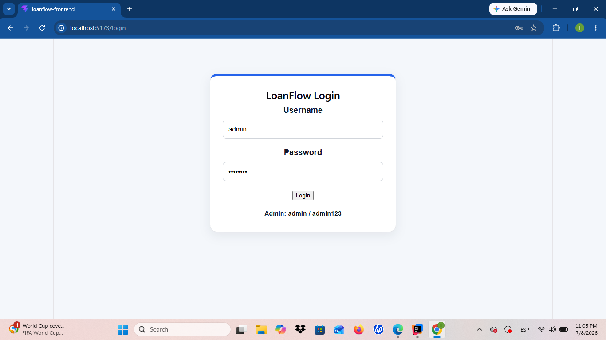
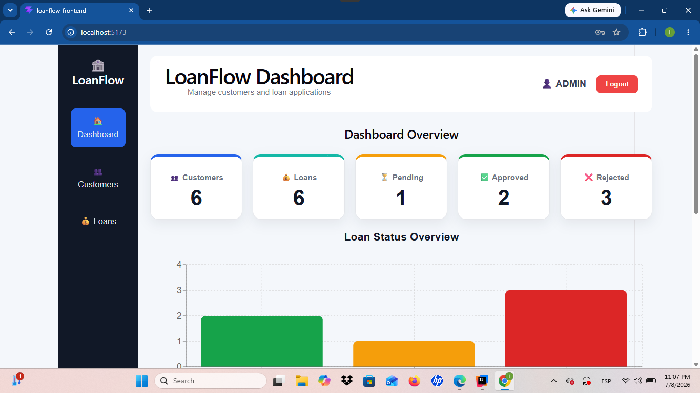
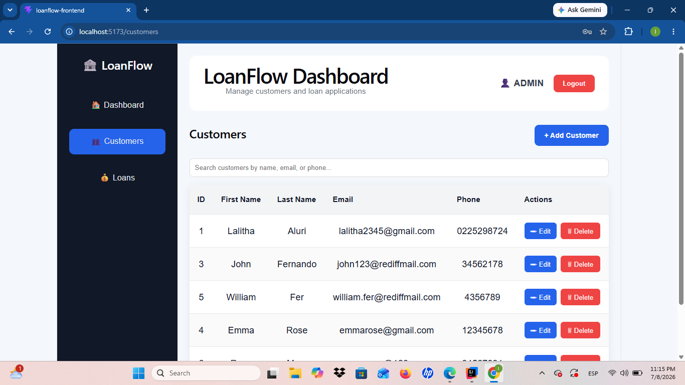
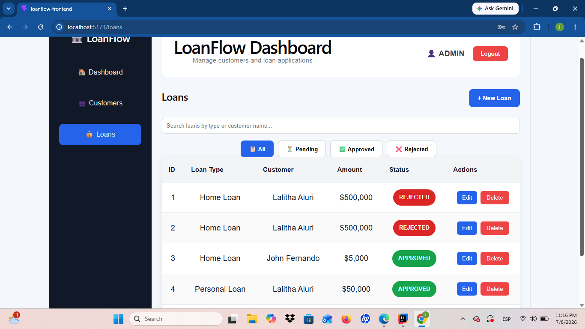
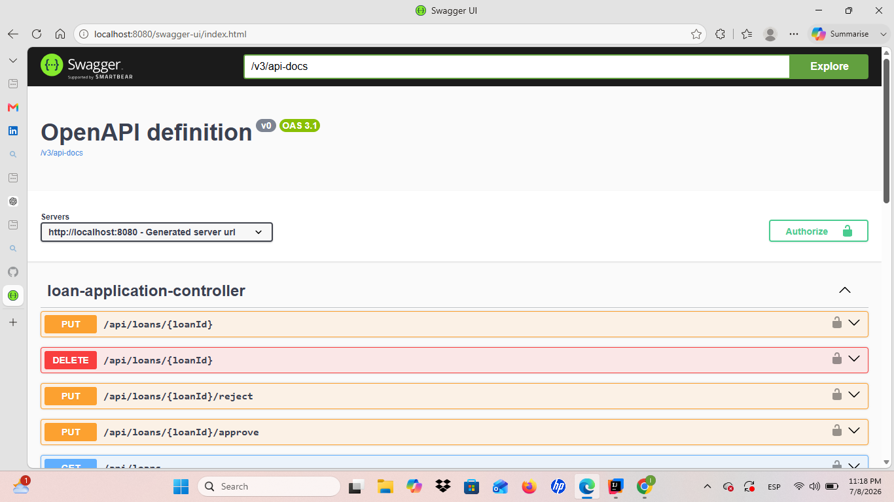

# 🏦 LoanFlow Enterprise

A secure, enterprise-style Loan Management System built with **Spring Boot 3**, **React**, **TypeScript**, **JWT Authentication**, and **Role-Based Authorization**.

LoanFlow Enterprise helps manage customers, process loan applications, approve or reject loan requests, and view business KPIs through a modern SaaS-style dashboard.

## 📑 Table of Contents

- [Project Overview](#project-overview)
- [Features](#features)
- [Technology Stack](#technology-stack)
- [Architecture](#architecture)
- [Project Structure](#project-structure)
- [Installation Guide](#installation-guide)
- [API Endpoints](#api-endpoints)
- [JWT Authentication Flow](#jwt-authentication-flow)
- [Screenshots](#screenshots)
- [Future Enhancements](#future-enhancements)
## 📑 

## 📖 Project Overview

LoanFlow Enterprise is a modern full-stack Loan Management System developed using Spring Boot and React. The application demonstrates enterprise software development practices including layered architecture, secure JWT authentication, role-based authorization, RESTful APIs, and a responsive SaaS-style user interface.

The system enables administrators and loan officers to manage customers, process loan applications, approve or reject requests, and monitor business insights through an interactive dashboard.

## ✨ Features

### Backend

- Secure JWT Authentication
- Spring Security
- Role-Based Authorization (Admin / Loan Officer)
- Customer Management (CRUD)
- Loan Management (CRUD)
- Loan Approval & Rejection Workflow
- RESTful APIs
- Global Exception Handling
- Swagger / OpenAPI Documentation
- CORS Configuration

### Frontend

- React + TypeScript
- Protected Routes
- Login & Logout
- Dashboard Overview
- KPI Cards
- Loan Status Bar Chart
- Recent Loan Applications
- Customer Management
- Loan Management
- Search & Filtering
- Pagination
- Responsive SaaS-style Interface
## 💻 Technology Stack

### Backend

| Technology | Purpose |
|------------|---------|
| Java 21 | Programming Language |
| Spring Boot 3 | Backend Framework |
| Spring Security | Authentication & Authorization |
| JWT | Secure Authentication |
| Spring Data JPA | Database Access |
| Hibernate | ORM Framework |
| Maven | Dependency Management |
| PostgreSQL | Database |
| Swagger/OpenAPI | API Documentation |

### Frontend

| Technology | Purpose |
|------------|---------|
| React | Frontend Framework |
| TypeScript | Type Safety |
| React Router | Navigation |
| Axios | API Communication |
| Recharts | Dashboard Charts |
| CSS | Enterprise UI Styling |

## 🏗️ Architecture

```text
                     +----------------------+
                     |   React Frontend     |
                     |  (TypeScript + Vite) |
                     +----------+-----------+
                                |
                     HTTP Requests (JWT)
                                |
                                v
                 +--------------+---------------+
                 |      Spring Boot REST API    |
                 |      Spring Security         |
                 |      JWT Authentication      |
                 +--------------+---------------+
                                |
                                v
                     Service Layer (Business Logic)
                                |
                                v
                      Repository Layer (JPA)
                                |
                                v
                         PostgreSQL Database
```
## 📁 Project Structure

```text
loanflow/
│
├── src/
│   ├── main/
│   │   ├── java/com/lalitha/loanflow/
│   │   │   ├── config/
│   │   │   ├── controller/
│   │   │   ├── dto/
│   │   │   ├── exception/
│   │   │   ├── model/
│   │   │   ├── repository/
│   │   │   ├── security/
│   │   │   └── service/
│   │   │
│   │   └── resources/
│   │
│   └── test/
│
├── loanflow-frontend/
│   ├── src/
│   │   ├── components/
│   │   ├── layouts/
│   │   ├── pages/
│   │   ├── services/
│   │   ├── types/
│   │   └── assets/
│
├── pom.xml
├── package.json
└── README.md
```
## ⚙️ Installation Guide

### Prerequisites

Before running the application, ensure the following are installed:

- Java 21
- Maven
- Node.js (v20 or later)
- pnpm
- PostgreSQL
- Git

---

### Clone the Repository

```bash
git clone https://github.com/lalithaaluri/loanflow-enterprise.git
cd loanflow
```

---

### Backend Setup

Install dependencies and start the Spring Boot application:

```bash
mvn clean install
mvn spring-boot:run
```

Backend runs at:

```
http://localhost:8080
```

Swagger UI:

```
http://localhost:8080/swagger-ui/index.html
```

---

### Frontend Setup

Open a new terminal:

```bash
cd loanflow-frontend
pnpm install
pnpm dev
```

Frontend runs at:

```
http://localhost:5173
```

## 🔗 API Endpoints

### Authentication

| Method | Endpoint | Description |
|--------|----------|-------------|
| POST | `/api/auth/login` | Authenticate user and return JWT |

---

### Customers

| Method | Endpoint | Description |
|--------|----------|-------------|
| GET | `/api/customers` | Get all customers |
| GET | `/api/customers/{id}` | Get customer by ID |
| POST | `/api/customers` | Create customer |
| PUT | `/api/customers/{id}` | Update customer |
| DELETE | `/api/customers/{id}` | Delete customer |

---

### Loans

| Method | Endpoint | Description |
|--------|----------|-------------|
| GET | `/api/loans` | Get all loans |
| GET | `/api/loans/{id}` | Get loan by ID |
| POST | `/api/loans` | Create loan |
| PUT | `/api/loans/{id}` | Update loan |
| DELETE | `/api/loans/{id}` | Delete loan |
| PUT | `/api/loans/{id}/approve` | Approve loan |
| PUT | `/api/loans/{id}/reject` | Reject loan |

## 🔐 JWT Authentication Flow

```text
User
 │
 │ Login
 ▼
React Frontend
 │
 │ POST /api/auth/login
 ▼
Spring Boot
 │
 │ Validate Username & Password
 ▼
Spring Security
 │
 │ Generate JWT
 ▼
React stores JWT in localStorage
 │
 │
 │ Every API Request
 │ Authorization: Bearer <JWT>
 ▼
Spring Security Filter
 │
 │ Validate JWT
 ▼
Protected REST APIs
```

### Authentication Process

1. User enters username and password on the login page.
2. Spring Security authenticates the credentials.
3. A JWT token is generated and returned to the frontend.
4. The frontend stores the JWT token in `localStorage`.
5. Axios automatically attaches the JWT token to all protected API requests.
6. Spring Security validates the JWT before allowing access to secured endpoints.
7. Role-based authorization determines whether the user can perform Admin or Loan Officer operations.
8. Logging out removes the JWT token from `localStorage`.

## 📸 Screenshots

> Screenshots will be added after the application deployment.

## 📸 Application Screenshots

### Login Page


---

### Dashboard


---

### Customer Management


---

### Loan Management


---

### Swagger API Documentation

## 🚀 Future Enhancements

The following enhancements can be added in future releases:

- Docker containerization
- GitHub Actions CI/CD pipeline
- Backend pagination using Spring Pageable
- Advanced dashboard analytics
- Email notifications
- Audit logging
- CSV / PDF export
- Unit & Integration testing
- Cloud deployment (AWS / Azure / Render)

## 👨‍💻 Author

**Lalitha Kumari**

Full Stack Developer

- Java
- Spring Boot
- React
- TypeScript
- PostgreSQL
- JWT Authentication
- REST APIs

## 📄 License

This project is developed for learning, portfolio demonstration, and professional showcase purposes.